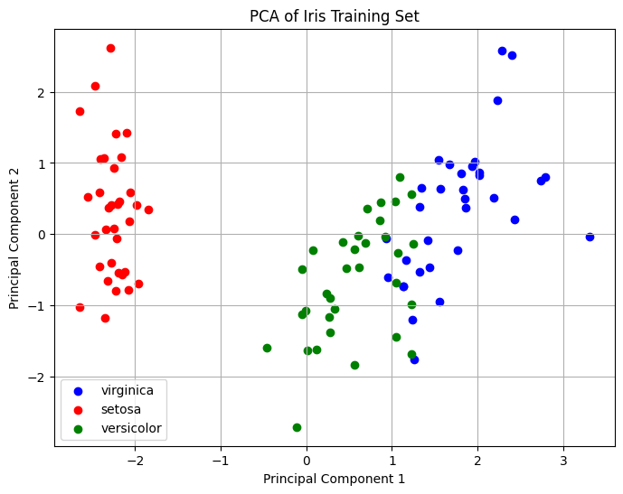

# **K-Nearest Neighbors (KNN) Algorithm on the Fisher Iris Dataset**

This project investigates the effectiveness of the **K-Nearest Neighbors (KNN)** algorithm in species classification using the Fisher Iris dataset. The primary focus is on understanding how the choice of **k**, the number of neighbors, impacts model accuracy and behavior. Through visualizations and detailed analysis, the project highlights KNN's strengths, limitations, and the influence of data characteristics on its performance.

---

## **Table of Contents**

1. Team Members
2. Institution
3. Key Methods Used
4. Results
    - Impact of k on Classification Accuracy
    - Visualization of Misclassifications
    - Visualization of the Dataset in 2D Space
5. Charts and Visualizations
6. Tools and Libraries
7. Challenges & Insights
8. Future Directions

---

## **1. Team Members**

- **Loc Pham**: Lead author and contributor to data preprocessing, model evaluation, and analysis of results.
- **Phuc Nguyen**: Contributor to algorithm implementation, visualization design, and documentation.

---

## **2. Institution**

Denison University, Granville, Ohio

- This research was conducted under the Department of Computer Science, emphasizing practical applications of machine learning algorithms.

---

## **3. Key Methods Used**

### **3.1. Data Preprocessing**

To ensure accurate model performance, preprocessing included:

- **Normalization**: Standardized feature values to prevent dominance by larger-scale features like petal length.
- **Stratified K-Fold Sampling**: Employed 50 folds with stratification to preserve class distribution across splits, enabling robust performance evaluation.

### **3.2. Feature Analysis**

The dataset consists of four features: sepal length, sepal width, petal length, and petal width. These features were analyzed to understand their contribution to classification.

- **PCA (Principal Component Analysis)**: Reduced dimensionality to two features while retaining most of the variance, enabling better visualization of class separability.

### **3.3. Model Development**

- **KNN Implementation**: Leveraged scikit-learn to implement the algorithm, using Euclidean distance for neighbor selection.
- **Parameter Exploration**: Tested multiple values of **k** to analyze its effect on model behavior and accuracy.

### **3.4. Evaluation Metrics**

- **Accuracy**: Measured for each value of k to identify trends.
- **Misclassification Rates**: Analyzed error distribution across species to identify patterns and challenges.
- **Visualization**: Plotted accuracy curves, misclassification breakdowns, and 2D projections to interpret model performance.

---

## **4. Results**

### **4.1. Impact of k on Classification Accuracy**

The value of **k** directly influences the KNN algorithm’s performance, with the accuracy following an **inverted U-shape pattern**:

- **Small k values (1-2)**:
    - Accuracy is low due to overfitting, where predictions are overly influenced by the closest neighbors.
    - The model is highly sensitive to noise or outliers in the training data, often misclassifying test samples that fall near class boundaries.
    - For example, a single anomalous point in the neighborhood may dominate the prediction, leading to poor generalization.
- **Moderate k values (9-11)**:
    - Accuracy reaches its peak (above 93%) as the model strikes a balance between capturing local data structure and avoiding over-sensitivity to noise.
    - The neighborhood size is sufficient to reflect broader patterns in the data without over-smoothing class boundaries.
    - These values represent the **optimal k range**, where the algorithm generalizes well while maintaining sensitivity to class distinctions.
- **Large k values (12+)**:
    - Accuracy declines due to underfitting, where decision boundaries become overly smooth.
    - The algorithm incorporates too many neighbors, including those from different classes, leading to diluted class-specific patterns.
    - This behavior results in misclassifications near overlapping regions of the feature space, particularly between Virginica and Versicolor.

### **4.2. Visualization of Misclassifications**

Detailed error analysis revealed the following key patterns:

- **Virginica vs. Versicolor**:
    - The majority of misclassifications occurred between these two species.
    - This is attributed to their overlapping feature distributions, as seen in PCA visualizations, which make it challenging for the algorithm to draw distinct decision boundaries.
    - These errors persisted across all **k** values, underscoring the inherent similarity between these classes.
- **Setosa**:
    - Rarely misclassified, even at low or high **k** values.
    - Its distinct feature space, as confirmed by PCA plots, ensures clear separation from the other two species.

### **4.3. Visualization of the Dataset in 2D Space**

Using **Principal Component Analysis (PCA)**, the dataset was reduced from four features to two principal components, retaining most of the variance. The 2D scatter plot provided critical insights:

- **Setosa**:
    - Displayed clear separability from the other two species, with no overlap in feature space.
- **Virginica and Versicolor**:
    - Exhibited significant overlap in the 2D space, particularly near decision boundaries.

---

## **5. Charts and Visualizations**

### **5.1. Accuracy vs k**

- **Key Insight**: Demonstrates the inverted U-shaped relationship between k and accuracy.
- **Highlights**: Peak accuracy at moderate k values, with noticeable overfitting and underfitting at extreme values.

### **5.2. Misclassification Percentages by Species**

- **Key Insight**: Stacked bar chart showing Virginica and Versicolor as the primary sources of errors.
- **Highlights**: Setosa maintains minimal misclassification rates across all k values.

### **5.3. 2D PCA Visualization**

- **Key Insight**: Visual representation of class separability, highlighting challenges with overlapping classes.
- **Highlights**: Clear separability of Setosa, contrasted with overlap between Virginica and Versicolor.

---

## **6. Tools and Libraries**

- **Scikit-learn**: For model implementation, normalization, and stratified k-fold sampling.
- **Matplotlib and Seaborn**: For visualizing accuracy trends, misclassification rates, and 2D projections.
- **PCA (Principal Component Analysis)**: For dimensionality reduction and enhanced interpretability.

---

## **7. Challenges & Insights**

### **7.1. Class Overlap**

- Significant feature overlap between Virginica and Versicolor led to persistent classification challenges.

### **7.2. k Parameter Sensitivity**

- **Low k values**: Overfitting caused high sensitivity to noise, resulting in misclassifications of outliers.
- **High k values**: Underfitting smoothed decision boundaries excessively, diluting class-specific distinctions.

---

## **8. Future Directions**

### **8.1. Alternative Distance Metrics**

### **8.2. Enhanced Feature Engineering**

### **8.3. Diverse Datasets**

### **8.4. Hybrid Models**

