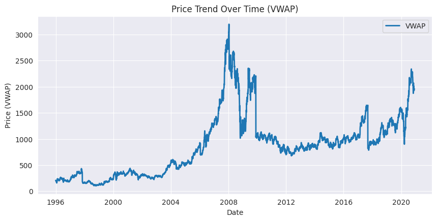
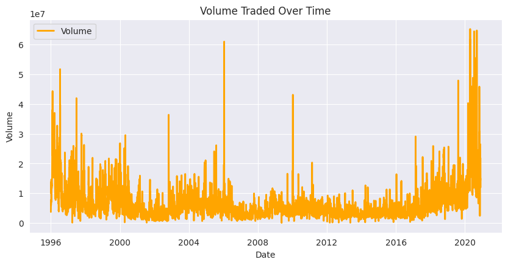
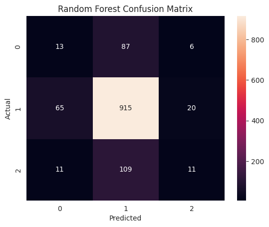
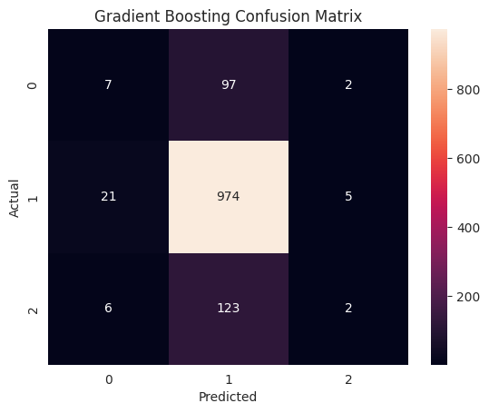
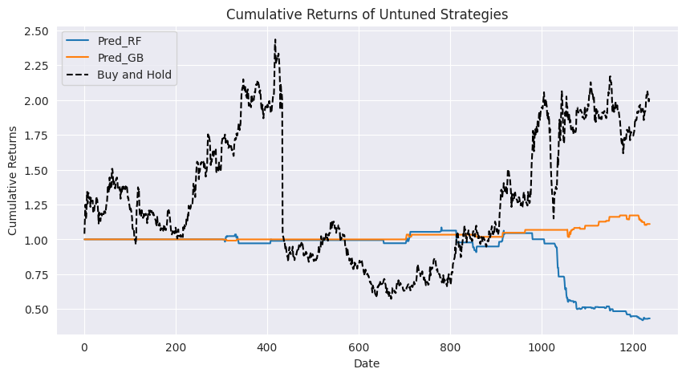
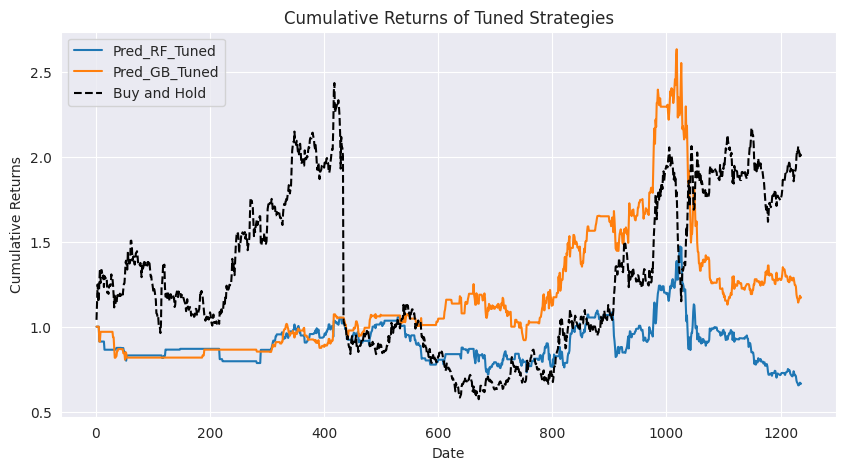

# **Stock Price Movement Prediction and Trading Strategy Backtesting**

This project explores machine learning techniques for predicting stock price movements and evaluating trading strategies. A detailed analysis of **Random Forest** and **Gradient Boosting** classifiers is conducted, with strategies benchmarked against a simple **Buy-and-Hold** approach.

---

## **Table of Contents**
1. [Overview](#overview)
2. [Key Features](#key-features)
3. [Project Structure](#project-structure)
4. [Setup and Installation](#setup-and-installation)
5. [Usage](#usage)
6. [Results](#results)
7. [Visualizations](#visualizations)
8. [Future Work](#future-work)
9. [License](#license)

---

## **Overview**

This project uses historical stock data to predict the future movement of Reliance Industries' stock prices. It focuses on:
- Data preprocessing and feature engineering for predictive modeling.
- Hyperparameter tuning to optimize machine learning performance.
- Backtesting trading strategies against a Buy-and-Hold benchmark.

---

## **Key Features**
- Prediction of stock price movements using **Random Forest** and **Gradient Boosting** models.
- Integration of **SMOTE** for addressing class imbalance.
- Hyperparameter optimization with **RandomizedSearchCV**.
- Backtesting of trading strategies with visual comparisons.
- Comprehensive evaluation using metrics such as **accuracy**, **precision**, **recall**, and **F1-score**.

---

## **Project Structure**
```
.
├── data/                     # Raw and processed data files
├── notebooks/                # Jupyter notebooks for analysis and modeling
│   ├── Exploratory_Data_Analysis.ipynb
│   ├── Model_Development.ipynb
│   └── Backtesting_Strategies.ipynb
├── images/                   # Charts and visualizations
├── README.md                 # Project documentation
├── requirements.txt          # Python dependencies
└── LICENSE                   # License for the project
```

---

## **Setup and Installation**

1. Clone the repository:
   ```bash
   git clone https://github.com/yourusername/stock-price-prediction.git
   cd stock-price-prediction
   ```

2. Install dependencies:
   ```bash
   pip install -r requirements.txt
   ```

3. Download the required datasets and place them in the `data/` directory.

---

## **Usage**

### **Run Jupyter Notebooks**
1. Open the terminal and navigate to the project directory.
2. Start Jupyter Notebook:
   ```bash
   jupyter notebook
   ```
3. Open and run the notebooks in the `notebooks/` directory for:
   - **Exploratory Data Analysis**
   - **Model Training and Evaluation**
   - **Backtesting Trading Strategies**

---

## **Results**

### **Model Performance**
- **Gradient Boosting**: 79% accuracy, slightly better recall for minority classes.
- **Random Forest**: 76% accuracy but struggles with minority predictions.

### **Backtesting Performance**
- **Buy-and-Hold**: 2.01 cumulative return.
- **Tuned Gradient Boosting**: 1.17 cumulative return.
- **Tuned Random Forest**: 0.67 cumulative return.

---

## **Visualizations**

1. **Volume Traded Over Time**  
   

2. **Price Trend Analysis**  
   

3. **Confusion Matrices**  
     
   

4. **Backtesting Results**  
   Untuned Strategies:  
     

   Tuned Strategies:  
   

---

## **Future Work**
- Incorporate macroeconomic indicators and sentiment analysis for improved features.
- Experiment with dynamic models such as **LSTMs** for sequential data.
- Develop realistic backtesting frameworks that include transaction costs and slippage.
- Focus on improving minority class predictions with cost-sensitive learning.

---

## **License**
This project is licensed under the MIT License - see the [LICENSE](LICENSE) file for details.

---

